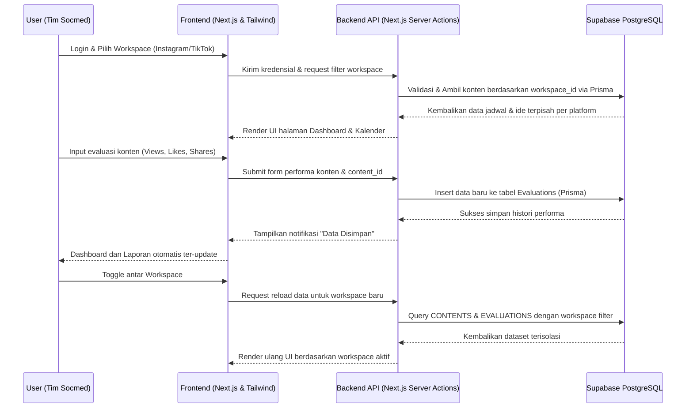
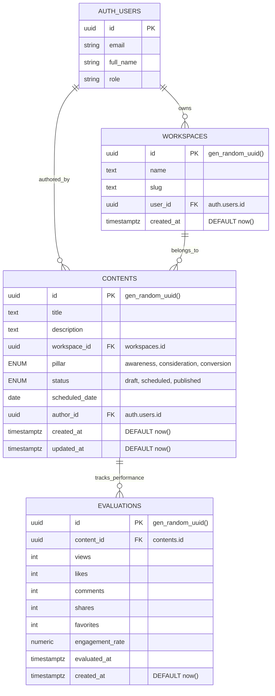

# PRD — Project Requirements Document

## 1. Overview

Tim Social Media Specialist di Sanggaluri Park Purbalingga saat ini mengelola konten Instagram dan TikTok secara manual menggunakan catatan pribadi, spreadsheet, dan grup WhatsApp. Proses yang tidak terpusat ini sering menyebabkan jadwal _upload_ terlewat, ide konten tercecer, dan kesulitan dalam melakukan evaluasi performa karena data tidak terekam dengan rapi.

**SanggaluriMS** hadir sebagai solusi berupa sistem manajemen _dashboard internal_ berbasis web. Tujuan utama aplikasi ini adalah merapikan alur kerja tim, menyimpan semua ide dan jadwal di satu tempat, dan memudahkan evaluasi konten tanpa perlu mencari-cari data di berbagai platform secara manual. Aplikasi ini akan terbagi menjadi 2 ruang kerja (_workspace_) terpisah khusus untuk Instagram dan TikTok.

## 2. Requirements

- **Hak Akses Internal:** Aplikasi ini tertutup hanya untuk pegawai internal (tim _social media_). Tidak ada fitur pendaftaran publik (_register_). Akun pengguna akan dibuatkan secara manual oleh Admin/Developer.
- **Pemisahan Platform:** Sistem harus memiliki toggle atau menu khusus untuk berpindah dari pengelolaan data Instagram dan TikTok (2 _workspace_ terpisah) agar data tidak tercampur.
- **Tidak Ada Integrasi API Eksternal:** Aplikasi bergantung pada pengisian data (_input_) manual dari _user_ untuk menyimpan metrik seperti jumlah _views_ atau _likes_, guna menekan kompleksitas dan biaya sistem.
- **Orientasi Desktop:** Mengingat fungsinya sebagai pengelola pekerjaan (_dashboard management_), rancangan antarmuka (UI) akan difokuskan untuk layar desktop.

## 3. Core Features

Sistem ini berfokus pada 4 modul utama yang dirancang untuk mempercepat kerja harian tim:

- **Dashboard Utama (Ringkasan Data harian & Bulanan)**
  - Menampilkan _Today's Upload_ (Konten apa yang harus diunggah hari ini dan status/kesiapannya).
  - Menampilkan _Best Content Last Month_ untuk memberikan gambaran cepat strategi apa yang berhasil.
  - Ringkasan data bulanan: Pertumbuhan _views_, total konten, dan rasio jumlah konten berdasarkan pilar (Awareness, Consideration, Conversion).
- **Kalender Konten (Jadwal Unggah)**
  - Menampilkan tampilan kalender per bulan.
  - Menggunakan status visual yang mudah dipahami: Warna Abu-abu untuk **Draft**, Warna Biru untuk **Scheduled**, dan Warna Hijau untuk **Published**.
  - Detail konten bisa dilihat ketika admin mengklik tanggal tertentu di kalender.
- **Content Plan (Manajemen Ide)**
  - Berbentuk papan visual (seperti kartu/Kanban) tempat tim menambah, mengubah, dan menghapus ide.
  - Kartu ide dikelompokkan berdasarkan pilar marketing: _Awareness_, _Consideration_, dan _Conversion_.
- **Modul Evaluasi & Laporan**
  - Form khusus untuk memasukkan _traffic/insight_ konten secara manual (jumlah _views_, _likes_, _shares_) ke dalam tabel evaluasi terpisah.
  - Menampilkan pencapaian konten terbaik (_best content_) per bulan berdasarkan data historis evaluasi.
  - Filter data evaluasi berdasarkan bulan terkini atau minggu lalu (_last week_).
  - Fitur untuk mengekspor (download) semua rangkuman kinerja bulanan (sukses/gagal _publish_ dan performa).

## 4. User Flow

1. **Login & Cek Jadwal Harian:** Pengguna (Social Media Specialist) _login_ menggunakan kredensial yang diberikan Admin. Saat masuk, pengguna langsung melihat **Dashboard** untuk mengecek _Today's Upload_ (konten apa yang harus diposting hari ini dan apakah statusnya sudah _Published_).
2. **Brainstorming & Planning:** Pengguna memilih _workspace_ (Instagram/TikTok), membuka menu **Content Plan**, menekan tombol "Tambah Ide", melengkapi rincian _caption_, memilih pilar (contoh: _Awareness_), dan menentukan target tanggal tayang (mengubah status menjadi _Scheduled_).
3. **Monitoring Bulanan:** Pengguna masuk ke menu **Calendar** untuk melihat warna-warni kotak tanggal. Warna Biru menandakan konten sudah dijadwalkan, dan Hijau menandakan sudah tayang. Jika masih tertinggal Abu-abu atau tidak berubah menjadi Hijau, pengguna diingatkan untuk memverifikasi tayangan.
4. **Input Evaluasi (Bisa Mingguan / Bulanan):** Pengguna melihat hasil data di platform Instagram/TikTok yang asli, lalu membuka menu **Evaluasi** di SanggaluriMS. Pengguna meng-_update_ angka _views_, _likes_, dan _shares_ secara manual. Data evaluasi disimpan dalam tabel terpisah dan langsung mengubah statistik _Best Content_ di Dashboard.

## 5. Architecture

Aplikasi ini menggunakan arsitektur _Client-Server_ modern berbasis Next.js di mana frontend dan urusan data base ditangani dalam satu wadah (_framework_) dan terhubung dengan Supabase sebagai pengelola basis data dan sistem masuk (Login/Auth). ORM (Prisma) bertugas sebagai jembatan yang menghubungkan instruksi dari Next.js ke database Supabase agar lebih aman dan terstruktur.

## 6. Database Schema

Skema data dirancang mengikuti _best practice_ Supabase (PostgreSQL + Supabase Auth) dengan normalisasi penuh, penggunaan UUID otomatis, dan pemisahan jelas antara ruang kerja, perencanaan, dan evaluasi performa. Entitas utama terdiri dari 3 tabel custom yang berelasi dengan tabel autentikasi bawaan Supabase.

- **Auth.users (Tabel Bawaan Supabase):** Tabel otentikasi standar Supabase yang menangani semua kredensial pengguna. Seluruh tabel custom mereferensikan `id` dari tabel ini untuk relasi pengguna.
- **Workspaces:** Tabel pengelompokan platform (`Instagram`, `TikTok`) yang dipisahkan per pengguna agar data tidak tercampur.
- **Contents:** Tabel utama perencanaan konten yang menggunakan ENUM untuk kolom `pillar` dan `status` guna memastikan integritas data dan alur kerja yang terstandarisasi.
- **Evaluations:** Tabel terpisah untuk histori metrik performa (`views`, `likes`, `comments`, `shares`, `favorites`, `engagement_rate`) agar pelacakan perubahan data dari waktu ke waktu lebih fleksibel dan terstruktur.

**Catatan Penting Skema & Optimisasi:**

- **Primary Key:** Semua tabel custom menggunakan `uuid` dengan _default_ `gen_random_uuid()` untuk kompatibilitas penuh dengan Supabase Auth dan standar UUID.
- **ENUM Values:** Kolom `pillar` dan `status` di tabel `contents` menggunakan tipe data ENUM PostgreSQL untuk mencegah input tidak valid dan mempercepat query filter.
- **Timestamps:** Semua kolom waktu (`created_at`, `updated_at`, `evaluated_at`) menggunakan tipe `timestamptz` dengan `DEFAULT now()` berdasarkan zona waktu server/database.
- **Database Indices:** Ditambahkan indeks pada `contents(workspace_id)` dan `evaluations(content_id)` untuk mempercepat operasi `JOIN` dan _query filtering_ antar workspace serta histori konten.
- **Relasi User:** Tidak ada tabel `users` kustom. Semua referensi penulis (`author_id`) dan kepemilikan workspace (`user_id`) langsung mengarah ke `auth.users.id` milik Supabase.

## 7. Tech Stack

Pilihan teknologi dititikberatkan pada pengembangan yang cepat, antarmuka modern yang rapi untuk manajemen, dan tidak memerlukan pemeliharaan server database mandiri. Berdasarkan kebutuhan internal Sanggaluri Park, berikut susunannya:

- **Frontend & Full-stack Framework:** Next.js (Dukungan penuh untuk Server Actions agar lebih simpel), JavaScript (+ TypeScript sangat disarankan untuk penggunaan Prisma).
- **Styling (Desain Visual UI):** Tailwind CSS untuk desain cepat dan fleksibel, digabung dengan koleksi _icon_ Lucide-React.
- **Database & Authentication:** Supabase (PostgreSQL _managed database_) yang sudah dilengkapi dengan Supabase Auth secara terintegrasi (hanya admin yang dapat memicu pembuatan akun baru).
- **ORM (Object-Relational Mapping):** Prisma (Untuk mengelola model basis data Supabase dengan _syntax_ penulisan yang sangat mudah dibaca oleh developer JavaScript).
- **Deployment:** Vercel (Hosting yang sangat optimal untuk framework Next.js sehingga proses rilis fitur dari developer bisa berjalan _real-time_).
